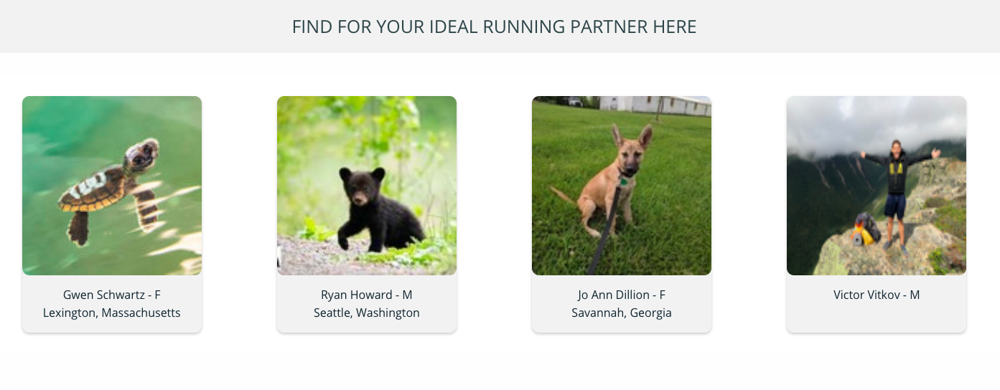
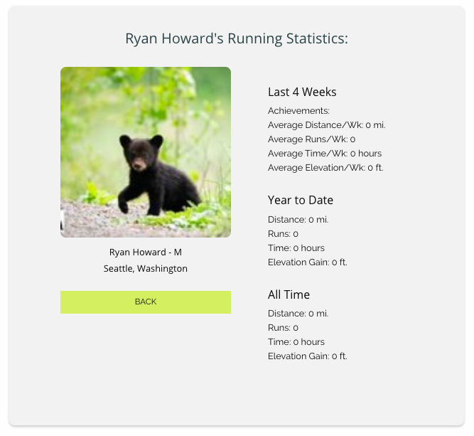
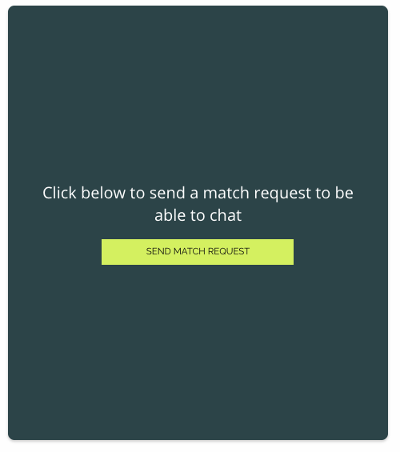
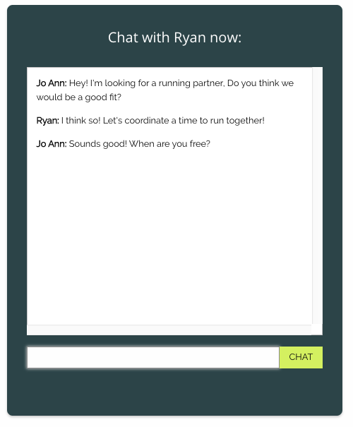

# Kiburi

Find your ideal running partner by browsing other people's Strava profiles. Send a match request and if you are matched in return, you will be able to chat in order to coordinate a time to meet up and go on a run or ride.

This React-Rails app allows uses OmniAuth to allow users to sign in with their Strava account.
Users are then stored with Postgres SQL, with their running statistics displayed through the
third party Strava API. The ability to chat in real time is made possible through Action Cable.

View it on Heroku at [Kiburi](http://kiburi.herokuapp.com/)

## Setup

Ruby Version 2.4.5

Rails Version 5.2.3

**Dependencies**
* omniauth-strava
* strava-ruby-client
* foundation-rails

**Database Creation and Initialization**

`rake db:create`

`rake db:migrate`

**Running the test suites**

Tests are written with RSpec, Capybara, Enzyme, and Jasmine.

`rspec`

`yarn test`

## How Kiburi Works

Sign up and create your profile by linking your account with Strava.

Browse other people's profiles to help find your best match.

Click on each profile to see more details about that person.

When you find someone who might be a match, click "SEND MATCH REQUEST".

That person can then choose to accept or deny the match request.

If they accept, you will be able to view a chatroom where you can get to know each other and coordinate further details.

Meet for a run with your new running partner!

## In Progress/Current Bugs

* I do not currently have a way to accept or deny match requests yet but plan to implement a component that will have accept or deny buttons and a component that will show pending depending on which user sent the request.
* Once you send a request, you need to refresh the page to see the chatroom. I plan to implement componentDidUpdate in order to render this without the refresh.
* If you go to your profile, you will need to send a match request to yourself to see your chats. I plan to adjust the logic to reset the state if the current user matches the user show page.
* Photos that are uploaded by users directly to Strava are displayed at a much lower resolution than photos users that have their Strava accounts linked to their Facebook or Google accounts. I plan to implement CarrierWave with AWS cloud storage in the future to allow users to upload their own photos.
